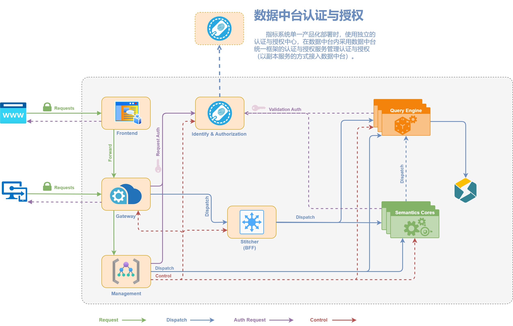

# BDT-Metric-Management


## 项目介绍

Metric-Management 是一个指标管理系统(指标中台的主要服务)，用于大数据环境下的指标定义、计算、存储和查询。

该系统提供了完整的指标生命周期管理，支持多种数据源接入，并提供灵活的API接口供其他系统调用。

系统采用微服务架构设计，基于Docker容器化部署，具有高可用性、可扩展性和易维护性的特点。

## 整体架构



## 功能特性

- **指标管理**：支持指标的创建、编辑、删除和版本控制
- **多数据源支持**：兼容MySQL、StarRocks、Spark等多种数据库/OLAP引擎
- **开放注册服务(ORS)**：基于JWT的可信系统间用户注册数据交换(用于Headless集成)
- **应用SDK**：提供Java语言的SDK，方便第三方系统接入
- **容器化部署**：基于Docker的快速部署和环境隔离

## 模块说明

系统由以下几个模块组成：

- **metric-management-api**：系统API接口定义
- **metric-management-impl**：核心业务逻辑实现
- **metric-sdk-ors**：开放注册服务SDK，用于系统间用户信息交换
- **metric-sdk-app**：应用接入SDK，提供系统接入能力

## 部署指南

### 环境要求

- Docker (version >= 20.10.16)
- Docker Compose (version >= 2.6.0)
- JDK 1.8+
- Maven 3.6+

### 部署步骤

***环境基于docker搭建，请确保本地已正确安装docker和docker compose***

***脚本适配Mac/Linux/Unix，windows环境请执行相应的bat文件***

***(Mac/Wsl下可以使用普通用户执行，Linux/Unix下使用root或具备admin组的用户执行)***

1. 拉取基础镜像，构建基础镜像
   ```shell
   cd ./docker-deps
   sh ./buildM3BaseImage.sh
   ```

2. 准备基础环境：创建docker网络
   ```shell
   docker network create --driver=bridge --subnet=192.168.10.0/24 --ip-range=192.168.10.0/24 --gateway=192.168.10.1 devnws
   ```

3. 准备基础环境：创建redis，mysql容器
   (***若环境容器已被其他项目启动，你需要在复用的mysql中手动创建项目的数据库&访问账密***)
   ```shell
   cd ./docker-deps
   docker compose up -d
   ```

4. 打包制作application镜像并运行
   ```shell
   sh ./docker-startup.sh
   ```

部署完成后，docker中将存在3个容器：

```shell
CONTAINER ID   IMAGE                   COMMAND                  CREATED       STATUS       PORTS                                                                                  NAMES
47fe00fd31ee   metric-management:1.0   "nohup java -jar -ag…"   4 days ago    Up 4 days    0.0.0.0:8989->8989/tcp, :::8989->8989/tcp, 0.0.0.0:9909->9909/tcp, :::9909->9909/tcp   metric-management
982c85c94642   mysql:8.0               "docker-entrypoint.s…"   4 weeks ago   Up 4 weeks   3306/tcp, 33060/tcp, 0.0.0.0:9918->9918/tcp, :::9918->9918/tcp                         m3sql
85b65b519391   redis:3.2               "docker-entrypoint.s…"   7 weeks ago   Up 6 weeks   0.0.0.0:6379->6379/tcp, :::6379->6379/tcp                                              m2redis
```

此时，程序已经在docker中运行起来：
- 服务端口：9909
- Debug端口：8989
- 日志目录：/tmp/logs/bdt-metric-management

## 开发说明

### 服务管理

- 关闭服务容器
  ```shell
  sh ./docker-stop-java.sh
  ```

- 重新部署代码
  ```shell
  sh ./docker-redeploy-java.sh
  ```

### 远程调试

服务容器在启动时，映射了服务端口及远程debug端口，在IDE中新建对应的remote JVM debug配置：
- 源码指向本地根目录
- 端口设定为8989
- 启动debug后，IDE将hit到容器的JVM进程中

### SDK使用

#### ORS (Open Register Service)

ORS是基于JWT构建的开放注册服务，用于在可信系统之间开放用户注册数据交换。

典型应用场景：
- 用户登录互通
- 影子账户登录

使用步骤：
1. 获取服务系统的接入入口及sign密钥组
2. 根据sign密钥组构建签署密钥交换器
   ```java
   //key组由验证方服务器提供
   String[] avatarKeys = {...};
   AvatarSignKeyExchanger avatarSignKeyExchanger = new AvatarSignKeyExchanger(avatarKeys);
   ```
3. 按步骤签署JWT
   ```java
   //构建jwt对象
   Jwt.Header header = ...
   ResignUserModel payload = ...
   String jwtStr = Jwt.buildToken(header, payload, avatarSignKeyExchanger);
   ```
4. 将JWT提交到验证方的接口

#### APP SDK

使用步骤：
1. 获取接入token
2. 根据token签署signKey，signValue
   ```java
   AppRequestModel requestModel = AppRequestModel.builder()
           .id(1)
           .name("指标系统4Android")
           .params(Arrays.asList(AppRequestModel.ValuePair.builder().name("id").value(1).build()))
           .signMills(System.currentTimeMillis())
           .build();
   requestModel.signValue("your token here");
   String headerValue = requestModel.toHeaderValue();
   System.out.println("Header Value : " + headerValue);
   ```
3. 将签署制品headerValue加入header发送

## 鸣谢

- [Spring Boot](https://spring.io/projects/spring-boot) - 应用框架
- [MetricFlow](https://github.com/dbt-labs/metricflow) - 指标语义层
- [xxl-job](https://github.com/xuxueli/xxl-job/) - 任务调度
- [owl-admin](https://github.com/slowlyo/owl-admin) - 前端

## 联系我


