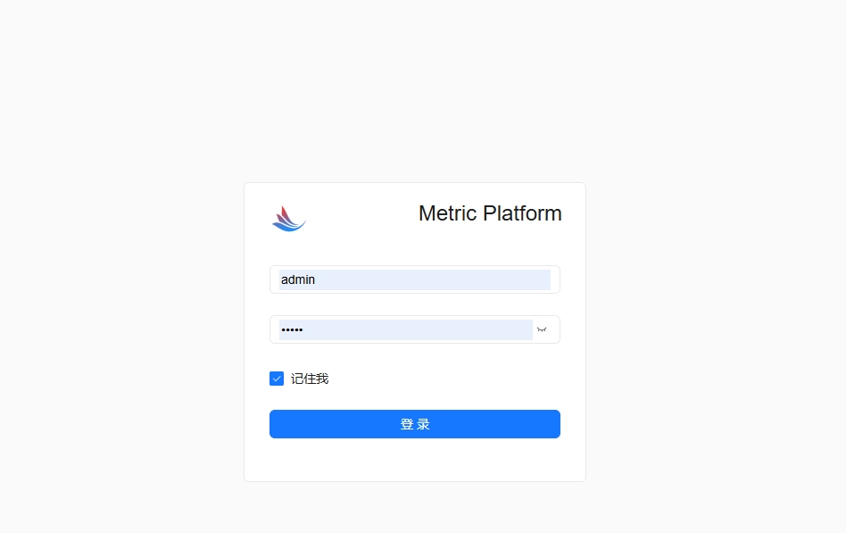

## 前端部署步骤

(指标系统原来有一套前端，由于可能涉及知识产权问题，故我借壳owl-admin重新开发了一套前端页面。)
###

进展：目前的指标系统后端是完整的系统，但新的前端适配率仅在40%。

### 原理

重用了owl-admin的前端，提供与owl-admin一致的接口。

### 版本信息

Tag：v4.1.5
Commit：0df5897a60bb5b79ee1169ef3e93e4830cc380bf

### 启动步骤

1、checkout owl-admin的源码

2、替换admin-views目录下的package.json及.env配置。
package.json使用文档提供的即可。
.env修改VITE_PROXY_URL为后端对应的地址及端口
```shell
# 代理地址, mode != production 时生效
VITE_PROXY_URL=http://localhost:9909
```

3、在shell界面中运行pnpm(owl-admin源码中包含如何独立构建前端的文档)
```shell
pnpm install && pnpm run dev
```

4、在浏览器中登录即可(路径：http://localhost:3200/admin-assets#/login)。



