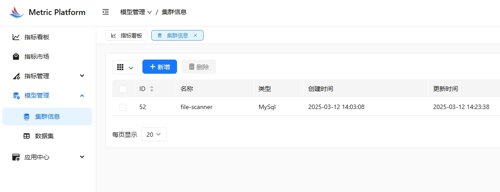
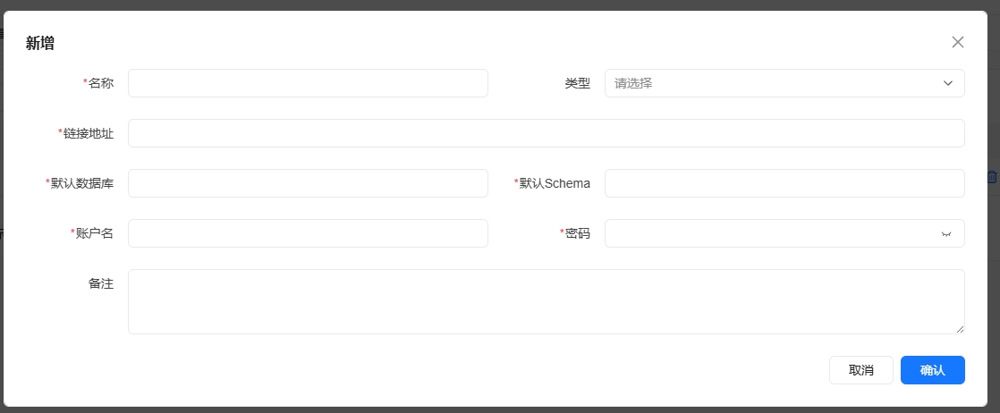

# 集群管理指南

本指南将帮助您了解如何在系统中管理和配置集群。

## 创建新集群

1. 在系统左侧导航栏中，点击"集群管理"选项。

2. 在集群管理页面，点击"新建集群"按钮。

3. 在弹出的表单中填写以下信息：
   - 集群名称：输入一个易于识别的集群名称
   - 集群类型：选择集群的类型（如Hadoop、Spark等）
   - 集群配置：根据需要配置集群的具体参数
   - 描述信息：（可选）添加关于该集群的补充说明

4. 填写完成后，点击"确定"按钮保存集群配置。

## 管理现有集群

在集群列表页面，您可以：

1. 查看集群信息：
   - 集群名称和类型
   - 创建时间
   - 当前状态
   - 配置信息

2. 编辑集群：
   - 点击"编辑"按钮修改集群配置
   - 更新集群参数或描述信息

3. 删除集群：
   - 点击"删除"按钮移除不再需要的集群
   - 删除前请确保该集群没有关联的任务或数据集

## 注意事项

1. 创建集群前，请确保您具有足够的权限。
2. 集群名称在系统中必须是唯一的。
3. 删除集群操作不可恢复，请谨慎操作。
4. 建议在配置集群时添加清晰的描述信息，以便后续维护和管理。