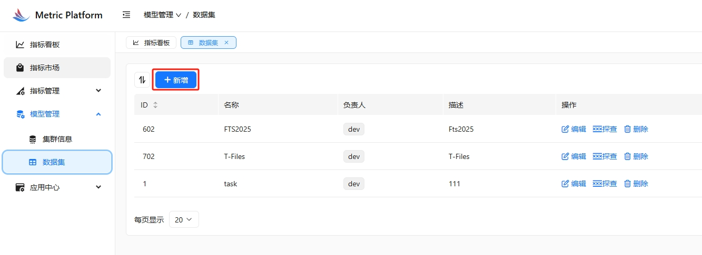
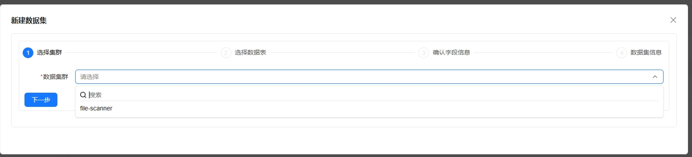
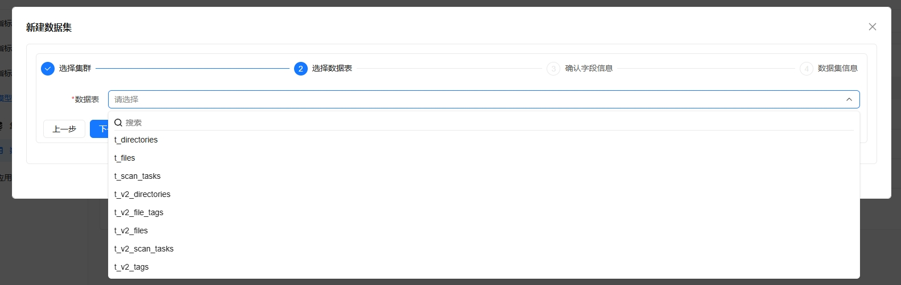
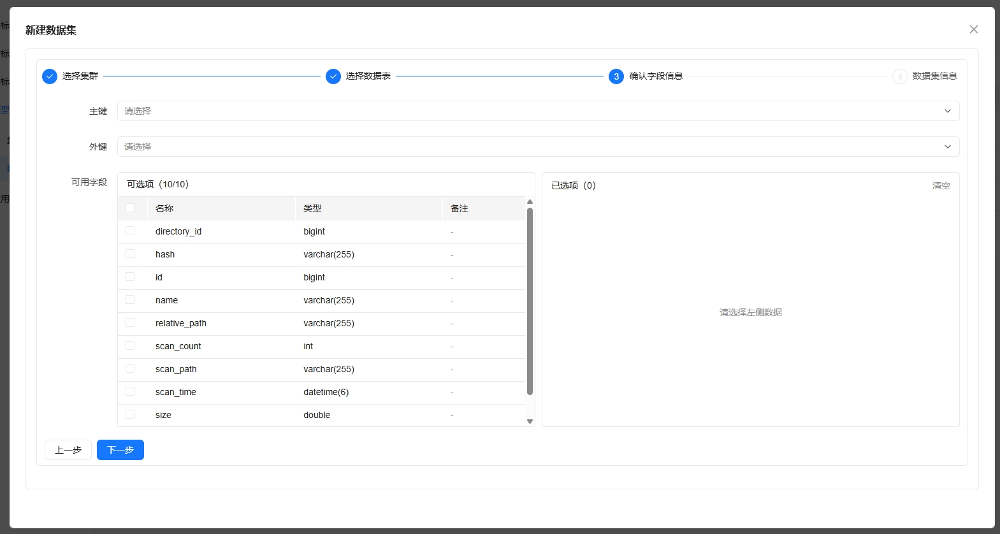
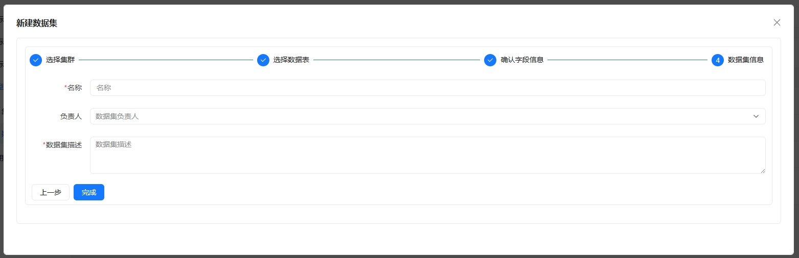
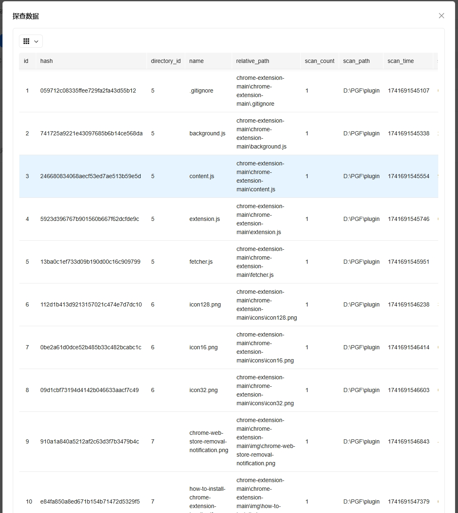

# 数据集管理指南

## 创建新数据集

1. 在系统左侧导航栏中，点击"数据集管理"选项。

2. 在数据集管理页面，点击"新建数据集"按钮。

3. 在数据集配置页面，填写基本信息：

   - 数据集名称：输入一个易于识别的名称
   - 所属集群：选择数据集所属的集群
   - 数据源类型：选择数据来源类型
   - 描述信息：（可选）添加关于该数据集的补充说明

4. 配置数据源连接信息：

   - 根据选择的数据源类型，填写相应的连接参数
   - 可以点击"测试连接"验证配置是否正确

5. 选择数据表和字段：

   - 从可用的数据表中选择需要的表
   - 选择需要包含的字段
   - 可以预览数据内容

6. 确认配置并保存：

   - 检查所有配置是否正确
   - 点击"保存"按钮完成数据集创建

## 管理现有数据集

在数据集列表页面，您可以：

1. 查看数据集信息：
   - 数据集名称和类型
   - 所属集群
   - 创建时间
   - 数据源信息

2. 编辑数据集：
   - 点击"编辑"按钮修改数据集配置
   - 更新连接参数或选择的数据表字段

3. 删除数据集：
   - 点击"删除"按钮移除不再需要的数据集
   - 删除前请确保该数据集没有被其他功能引用

## 注意事项

1. 创建数据集前，请确保相关的集群已经配置完成。
2. 数据源连接信息要确保正确，建议使用测试连接功能验证。
3. 选择数据表和字段时要考虑数据量，避免选择过多不必要的字段。
4. 定期检查数据集的连接状态，确保数据可以正常访问。
5. 在删除数据集前，检查是否有依赖该数据集的指标或任务。