# 指标管理指南

## 创建新指标

1. 在系统左侧导航栏中，点击"指标管理"选项。
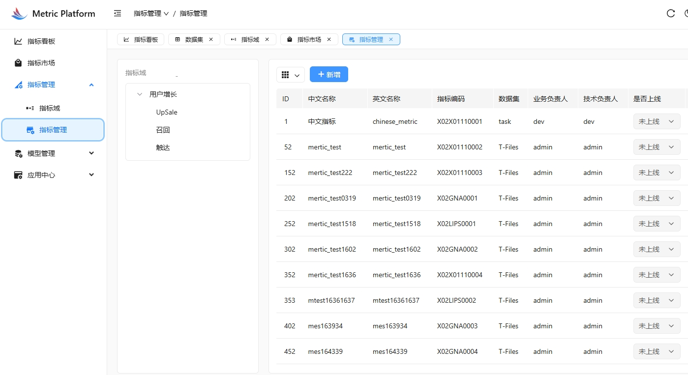

2. 在指标管理页面，点击"新建指标"按钮。
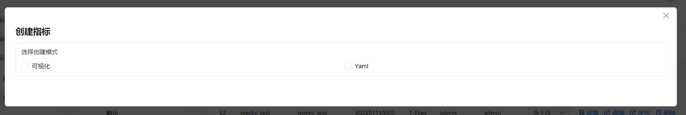

3. 在指标配置页面，填写基本信息：
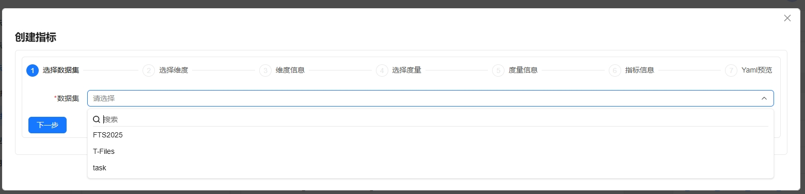
   - 指标名称：输入一个易于识别的名称
   - 指标类型：选择指标的类型
   - 所属目录：选择指标所属的目录分类
   - 描述信息：（可选）添加关于该指标的补充说明

4. 选择数据源：
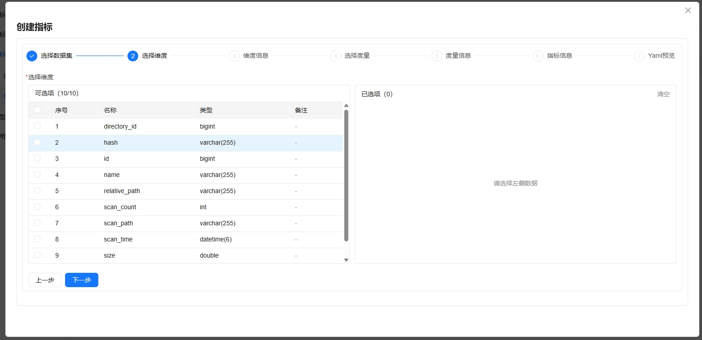
   - 从已配置的数据集中选择数据源
   - 可以预览数据源的表结构和字段信息

5. 配置计算逻辑：
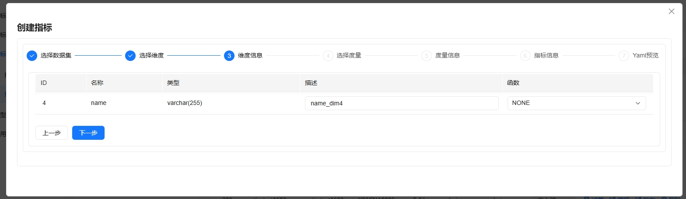
   - 选择需要的计算字段
   - 设置计算公式和条件
   - 配置聚合方式

6. 设置过滤条件：
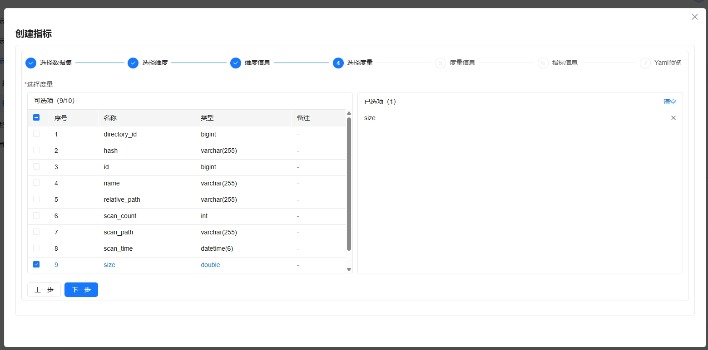
   - 添加数据过滤条件
   - 设置时间范围
   - 配置其他筛选参数

7. 配置展示方式：
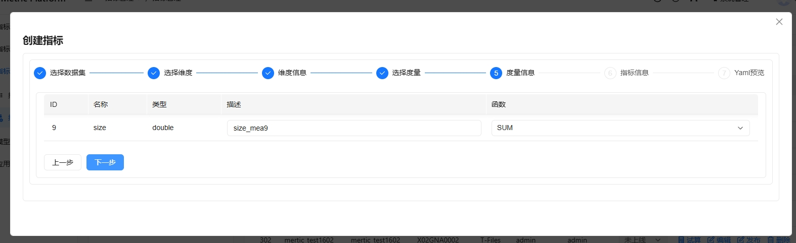
   - 选择展示类型（如表格、图表等）
   - 设置展示样式
   - 配置数据排序方式

8. 预览和测试：
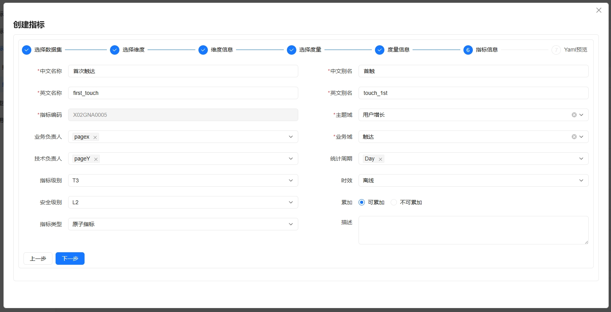
   - 预览指标计算结果
   - 验证数据的准确性
   - 调整配置参数

9. 设置权限：
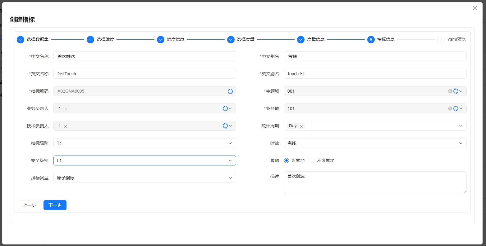
   - 配置访问权限
   - 设置可见范围
   - 管理用户权限

10. 保存配置：
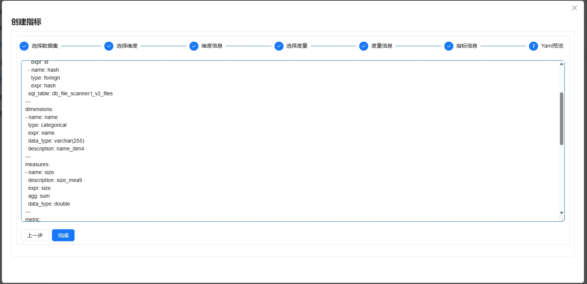
   - 检查所有配置是否正确
   - 点击"保存"按钮完成指标创建

## 管理现有指标

在指标列表页面，您可以：

1. 试算指标数据：
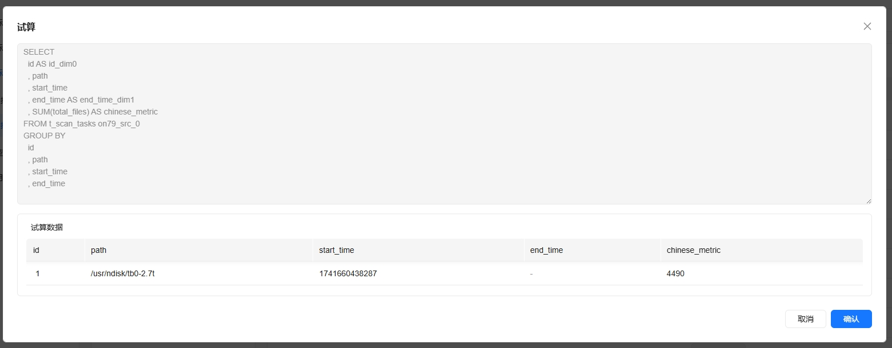

2. 发布指标：
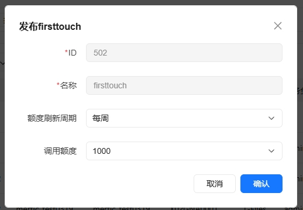

   (指标在分布式需要设定额度刷新周期及调用额度限制，以限制指标的总调用额度)

   (发布状态的指标将进入指标市场，供开发者申请调用权限以进行应用接入)

4. 删除指标：
   - 点击"删除"按钮移除不再需要的指标(删除仅支持下线/未发布的指标)
   - 删除前请确保该指标没有被其他功能引用